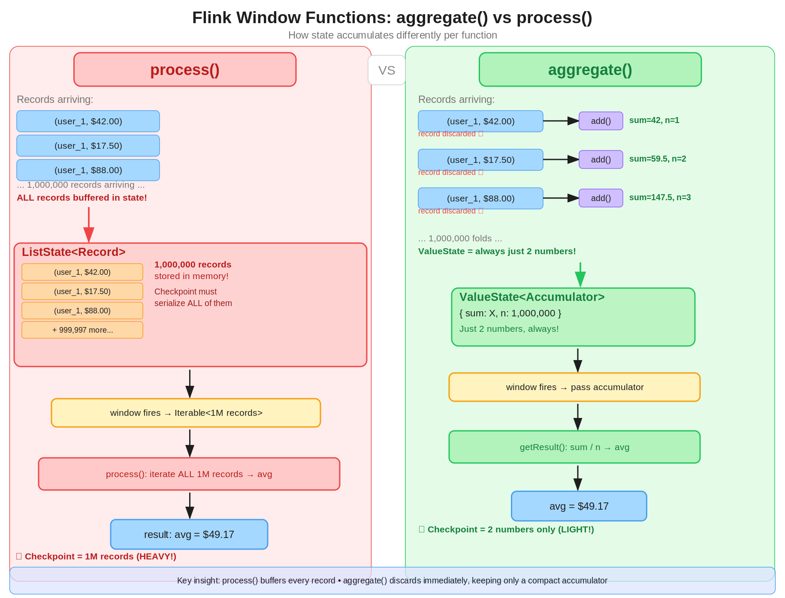

# Difference between `aggregate()` vs `process()`

The concrete difference:

* `process()` buffers everything. Flink stores every raw record in state until the window fires, then hands the full `Iterable<T>` to your function. This means:
    * State size grows linearly with every incoming record
    * Checkpoints must serialize all those raw records
    * On recovery, Flink replays from that serialized buffer
* `aggregate()` discards records immediately. The moment a record arrives, `add()` folds it into the `accumulator`, and the original record is thrown away. Only the compact accumulator lives in state.

## Example

### Problem: Visualize two equivalent versions of computing average value per `userId`, but one uses `process()` while another uses `aggregate()`.



### Version 1: `process()`

```
What Flink is secretly doing on EVERY incoming record:

   record arrives: (user_1, $42.00)  → ListState: [(user_1,$42.00)]
   record arrives: (user_1, $17.50)  → ListState: [(user_1,$42.00), (user_1,$17.50)]
   record arrives: (user_1, $88.00)  → ListState: [..., (user_1,$88.00)]
   ... 1 million records later ...
   window fires   → hand Iterable of 1,000,000 records to process()
   process() runs → you iterate all 1M records to compute the average
   window clears  → ListState emptied

The checkpoint taken mid-window must serialize ALL those records.
```

### Version 2: `aggregate()`

```
What Flink is secretly doing on EVERY incoming record:

    record arrives: (user_1, $42.00)
        → add((user_1,$42.00), (sum=0, n=0))
        → ValueState updated to (sum=42.0, n=1)
        → record (user_1, $42.00) is DISCARDED immediately

    record arrives: (user_1, $17.50)
        → add((user_1,$17.50), (sum=42.0, n=1))
        → ValueState updated to (sum=59.5, n=2)
        → record (user_1, $17.50) is DISCARDED immediately

    record arrives: (user_1, $88.00)
        → add((user_1,$88.00), (sum=59.5, n=2))
        → ValueState updated to (sum=147.5, n=3)
        → record (user_1, $88.00) is DISCARDED immediately

    ... 1 million records later — ValueState is STILL just 2 numbers ...

    window fires
        → getResult((sum=X, n=1_000_000))
        → output the average

The checkpoint taken mid-window only needs to serialize 2 numbers.
```

## The internal state difference, side by side
```
                     process()                    aggregate()
                     ─────────────────────────    ──────────────────────
State type           ListState<Record>            ValueState<Accumulator>
State after 1M recs  1,000,000 records stored     2 numbers stored
When computed        At window fire (batch)        Every record (incremental)
Checkpoint payload   All 1M records               2 numbers
Recovery cost        Deserialize all records       Deserialize 2 numbers
Your function sees   Iterable<all records>         One final acc value
```